Native Dialogs
-----------------
**Use native dialogs with same code on Windows,Mac OSX and Linux(GTK3 required).**

## Features:
* C++11 support and required
* Easy to use
* Native user interface
* Native message dialog
* Native file chooser dialog
* Native color picker dialog

## Integrate to your project
* Add all files under src to your project
* inclue NativeDialog.h file to your code
* Remove code under osx if it's not a OSX application
* Remove code under win if it's not a Windows application

## Usage:

### Message Dialog

* Show native notice dialog with one line

```c++
MessageDialog("Notice","Hello World!",{"Close"}).show();
```

Platform|Screenshot
---|---
Windows|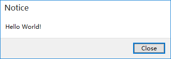
GTK|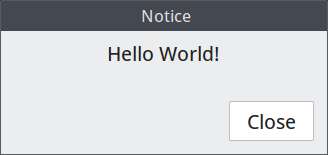
OS X|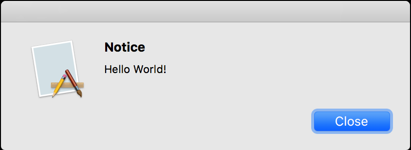

* Deal events as you like

```c++
MessageDialog mdlg("Notice","Do you want to quit?",{"Yes","No"});
mdlg.setDecideHandler([](const Dialog& dlg){
    auto mdlg = dynamic_cast<const MessageDialog&>(dlg);
    if( mdlg.responseButtonTitle() == "Yes" ){
        // He want to quit
    }
    else if(mdlg.responseButtonIndex() == 1) {
        // He is not sure to quit
    }
})
.show();
```
Platform|Screenshot
---|---
Windows|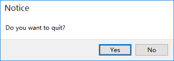
GTK|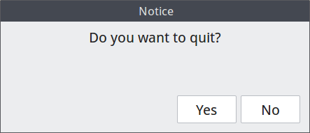
OS X|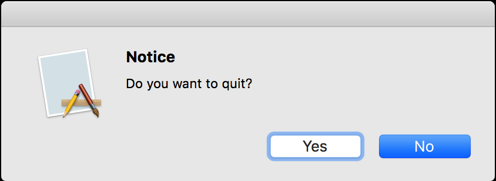

### File Chooser Dialog

* File selection
* Directory selection
* Multiselection
* Save file mode
* Filters are easy to set

```c++
FileDialog fdlg("Open some text files",
                FileDialog::SELECT_FILE|FileDialog::MULTI_SELECT);
fdlg.setDefaultPath("..")
    .addFilter("Text Files","txt")
    .addFilter("Code files","c;cpp;h;hpp")
    .addFilter("All files","*")
    //.setSaveMode(true) // Set save mode
    .setDecideHandler([](const Dialog& dlg){
        auto fdlg = dynamic_cast<const FileDialog&>(dlg);
        const std::vector<std::string>& fileList = fdlg.selectedPathes();
        // All pathes are in absolute format
      })
    .setCancelHandler( [](const Dialog& dlg){
        // Nothing selected as it was canceled
      }
    )
    .show();
```
Platform|Screenshot
---|---
Windows|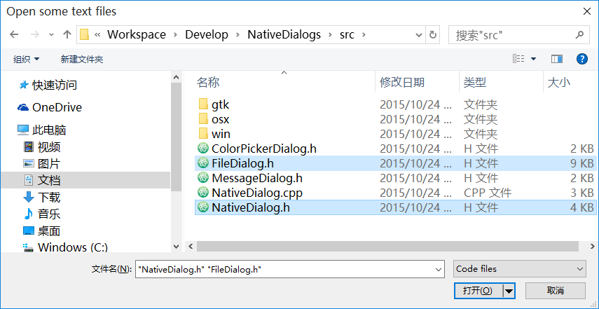
GTK|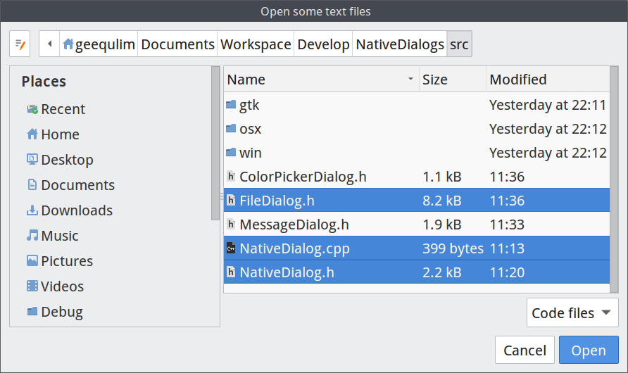
OS X|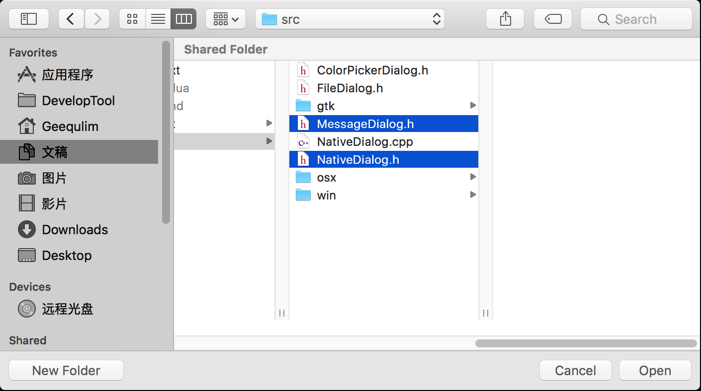

### Color Picker Dialog

No more thing but you want

```c++
ColorPickerDialog cdlg("Pick a color you like");
cdlg.setColor({1,0,1,1}) // Set default selected color
.setDecideHandler( [](const Dialog& dlg){
    auto colorDlg = dynamic_cast<const ColorPickerDialog&>(dlg);
    auto color = colorDlg.color();
    // Get color value with color.r,color.g,color.b and color.a
  })
.show();
```

Platform|Screenshot
---|---
Windows|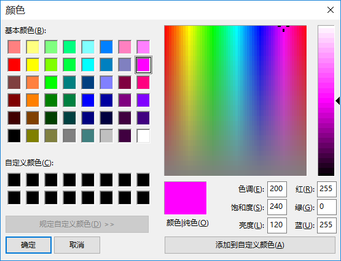
GTK|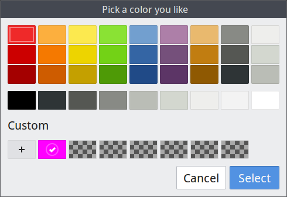
OS X|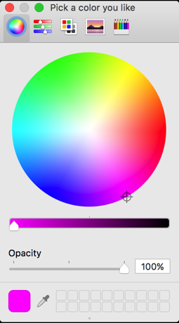

#### More about usage : [test.cc](test.cc)

### Notice for platform specifications

* Color Picker Dialog won't pause your thread on Mac OSX
* File Dialogs support set host window with a `NSWindow*` value by `setHostWindow` method on Mac OSX
* Filters of File Dialog are invisible but it works on Mac OSX
* Select Multi-Directory is not allowed on Windows and GTK
* Windows has a diffrent UI for directory selection like this

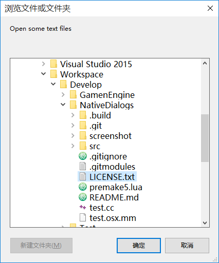


---

Here is a demo that use a glfw window as host window for Mac OSX : [test.osx.mm](test.osx.mm)

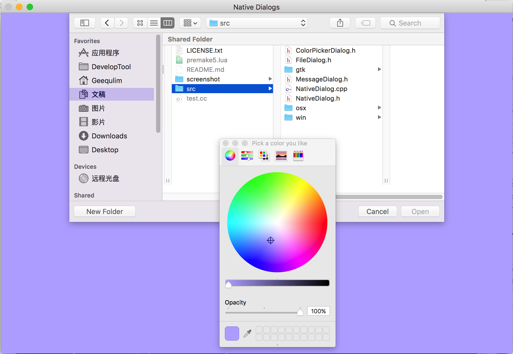

#### TODO:

* Native font select dialog

## LICENSE
Under [MIT LICENSE](LICENSE.txt) .
